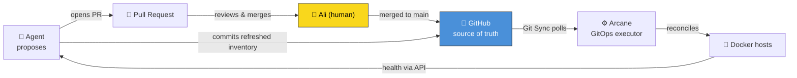

# Skynet

> A homelab that runs itself — safely. A GitHub repo is the single source of truth, an
> AI ops agent proposes every authored change as a pull request, and **you** merge it. The only
> self-merge is the generated-only nightly when CI is green. No authored production change lands
> without a human hand on the merge button.

**Skynet** is the operations layer for a self-hosted lab: two Proxmox nodes, a PBS backup
server, Docker hosts, Technitium DNS, and an OPNsense firewall. It's run by an agent on
`vm-skynet-ops` (`10.10.90.90`) that builds and maintains infrastructure the way a careful
junior engineer would — plan, propose, get approval, execute, leave evidence.

The whole point: **infrastructure you can rebuild from a laptop, a phone hotspot, and this
repo** — OPNsense included.

---

## The big idea

- **The repo is the truth.** Compose files, runbooks, docs, and machine-collected inventory
  all live in git. If it isn't in the repo, it isn't real.
- **Agent-agnostic by contract.** The operating manual lives in **[`AGENTS.md`](AGENTS.md)** — a
  vendor-neutral contract. Codex CLI reads it natively; Claude Code, Goose, and Amp honor it.
  *Any agent that can read a file and run bash can operate Skynet.* Swapping engines changes one
  line in [`bin/ops`](bin).
- **GitOps deploys.** [Arcane](https://arcane.ofkm.dev) watches this repo and reconciles Docker to
  match it. You merge a PR; the lab converges. Rollback is `git revert`.
- **Humans hold the keys.** Secrets are sops-encrypted in git. Root on a host exists **only**
  inside an auto-expiring SSH certificate — and the CA private key never leaves the workstation.
  The agent *requests*; the human *types*.

---

## 📊 State of the Lab

Every night the agent writes a fresh, human-readable
**[State of the Lab](docs/generated/05-state-of-the-lab.md)** — a one-glance dashboard of what's
healthy, where the build stands, and what it's keeping an eye on, rendered from live inventory.
It's the friendliest way to see where Skynet is right now.

For the machine's own orientation there's a companion
**[agent digest](docs/generated/06-agent-digest.md)** — recent decisions, open threads, and recent
episodes, assembled from the [`journal/`](journal/README.md) and the roadmap — which a fresh agent
session reads first on a cold boot.

---

## How a change actually happens



Nobody merges their own work — **especially not the agent.** Something breaks? `git revert`,
and Arcane rolls the lab back to the last good state.

---

## Trust tiers — the blast-radius dial

The agent's power is graduated. Most of the day it can only *look*; anything that can hurt
the lab is either PR-gated or requires a credential a human hands over for a few hours.

| Tier | What it can do | Standing access? |
|---|---|---|
| **T1 · Read** | See everything — both Proxmox nodes, PBS, Docker, DNS, firewall | ✅ Always |
| **T2 · Operate** | Change managed guests/Docker, DNS records, Authentik apps/providers; non-leash OPNsense config is approved here but still being implemented — **all PR-gated** | ✅ except pending OPNsense write path |
| **T2+ · Root grant** | Root shell on a workload host, to harden/provision/patch | ⏳ Only inside a cert's validity window |
| **T3 · Privileged** | OPNsense node/admin/reboot/self-leash, Authentik admin, node/Unraid OS root, DNS *settings* | ❌ **Never standing** — dormant alias + per-session secrets |

> The authoritative definitions live in **[`AGENTS.md §1`](AGENTS.md)** and
> **[`docs/system-design.md`](docs/system-design.md)** — this table is the postcard, those are
> the map. If they ever disagree, **the design wins.**

OPNsense VM 5001 and CTs 635/837 are read-only at the guest envelope and never join a managed pool.
Unraid VM 2020 also remains unpooled and its guest OS is T3. The core-node operate ACL can technically
reach its VM envelope, but automated/OpenTofu paths must not target it; power/config is a human hard
checkpoint. The constitution documents that deliberate core exception.

---

## Repo map

```
skynet/
├── AGENTS.md            ★ the operating contract — start here (every engine reads this)
├── CLAUDE.md            Claude Code shim — just imports AGENTS.md (one source of truth)
├── bin/                 human entrypoints:  ops · grant-root · plan
├── ca/                  SSH CA & agent PUBLIC keys (trust anchors; privates never here)
├── compose/             one dir per service — the "skynet way" Arcane git-syncs
├── docs/                design & how-it-works ── system-design.md is the master design (+ design/ spokes)
│   └── generated/       🤖 machine-written by render-docs.sh — never hand-edit
├── inventory/           🤖 machine-collected JSON truth (Proxmox, DNS, firewall…)
├── planning/            Skynet Directives (SKY-###) — where future work is born
├── runbooks/            step-by-step procedures any agent can execute
└── scripts/             the capabilities — plain bash the agent runs
```

New here? Read in this order: **this file → [`AGENTS.md`](AGENTS.md) →
[`docs/system-design.md`](docs/system-design.md)**. Then browse
[`runbooks/`](runbooks/) for what the agent can *do* and
[`planning/`](planning/README.md) for what's *coming*.

---

## Judgement Day rules (the invariants that never bend)

These are the guarantees that make an autonomous agent safe to keep around:

- 🔐 **No standing keys to privileged control planes.** OPNsense node/admin/reboot/self-leash,
  Authentik administration, node/Unraid OS root, and DNS settings stay dormant. Their explicitly
  scoped T1/T2 slices are defined in the authoritative trust model.
- ⏱️ **Root always expires by itself.** The CA lives only on the workstation + the printed
  survival kit. The agent literally *cannot* mint its own access.
- 🙅 **The agent never merges its own PR**, and never hand-edits generated dirs
  (`inventory/`, `docs/generated/`).
- 🤫 **No plaintext secrets, ever** — sops-encrypted in git, or `0600` on disk. Never in a
  commit, a transcript, or a chat.
- 🌙 **Nightly runs are report-only** until an action is explicitly promoted, by PR, to the
  auto-approve list. Even the leash is version-controlled.
- 🧯 **The kill switch is drilled before autonomy day one:** disable tokens + `qm stop 9090`.

The full checklist is in [`AGENTS.md §6`](AGENTS.md).

---

## Everyday commands

```bash
bin/ops nightly          # the report-only maintenance pass (also runs on a systemd timer)
bin/ops collect          # refresh machine inventory (T1, read-only)
bin/grant-root <host> 2h # human mints an auto-expiring root cert for the agent
bin/plan idea "…"        # capture future work as a Skynet Directive
```

---

*Skynet is a learning project as much as an infrastructure one — the PRs are written to teach.
If a change here surprises you, that's a bug in the explanation, not just the code.*
