> [!note] Auto-generated by `scripts/render-docs.sh` — do not edit by hand. Last run 2026-08-28T18:57:38+00:00.

```mermaid
graph TD
  WAN[WAN uplinks] --> OPN[OPNsense router]
  OPN --> V10[VLAN 10 · Trusted LAN]
  V10 --> n10_50["RK-W"]
  V10 --> n10_55["ROLE_ADMIN_CLIENTS"]
  V10 --> n10_60["Alis-iPhone"]
  V10 --> n10_65["Alis-iPad"]
  OPN --> V20[VLAN 20 · Servers]
  V20 --> n20_15["ROLE_NFS_CLIENTS"]
  V20 --> n20_20["HOST_UNRAID"]
  V20 --> n20_40["HOST_PBS"]
  OPN --> V30[VLAN 30 · IoT]
  V30 --> n30_55["ROLE_ADMIN_CLIENTS"]
  V30 --> n30_60["Alis-iPhone-IoT"]
  V30 --> n30_65["Alis-iPad-IoT"]
  OPN --> V50[VLAN 50 · Management]
  V50 --> n50_1["ROLE_INFRASTRUCTURE_FIREWALL"]
  V50 --> n50_2["ROLE_INFRASTRUCTURE_SWITCHES"]
  V50 --> n50_3["ROLE_INFRASTRUCTURE_SWITCHES"]
  V50 --> n50_4["ROLE_INFRASTRUCTURE_SWITCHES"]
  V50 --> n50_6["ROLE_INFRASTRUCTURE_APS"]
  V50 --> n50_7["ap-omada-downstairs"]
  V50 --> n50_8["ROLE_INFRASTRUCTURE_APS"]
  V50 --> n50_9["ROLE_INFRASTRUCTURE_APS"]
  OPN --> V60[VLAN 60 · Admin Access]
  V60 --> n60_35["HOST_PROXY_ADMIN"]
  OPN --> V70[VLAN 70 · Network Services]
  V70 --> n70_30["ROLE_DNS_RESOLVERS"]
  V70 --> n70_31["ROLE_DNS_RESOLVERS"]
  V70 --> n70_50["tdns-network.tdns.home.aliammar.net"]
  V70 --> n70_51["tdns-core.tdns.home.aliammar.net"]
  OPN --> V80[VLAN 80 · Identity]
  V80 --> n80_37["HOST_AUTHENTIK"]
  OPN --> V90[VLAN 90 · Operations]
  V90 --> n90_15["ROLE_NFS_CLIENTS"]
  V90 --> n90_90["HOST_SKYNET_OPS"]
  V90 --> n90_91["HOST_SKYNET_OPS"]
  OPN --> V100[VLAN 100 · DMZ]
  V100 --> n100_15["HOST_DOCKER_DMZ"]
  V100 --> n100_33["HOST_CLOUDFLARED"]
  V100 --> n100_35["HOST_PROXY_APPS"]
  V100 --> n100_65["ROLE_USENET_CLIENTS"]
  V100 --> n100_69["ROLE_DMZ_AI_CLIENTS"]
  V100 --> n100_85["ROLE_DMZ_AI_CLIENTS"]
```

_VLAN names are best-effort; hosts are merged from OPNsense DHCP reservations, firewall
host aliases (the static services), and unique-target DNS records. Up to 8 hosts shown per VLAN._
