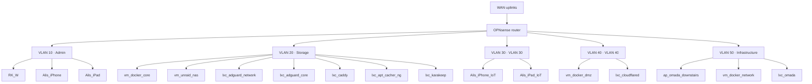

> [!note] Auto-generated by `scripts/render-docs.sh` — do not edit by hand. Last run 2026-08-15T21:55:54+00:00.

_VLAN names are best-effort; subnets/hosts are live from OPNsense DHCP reservations._
