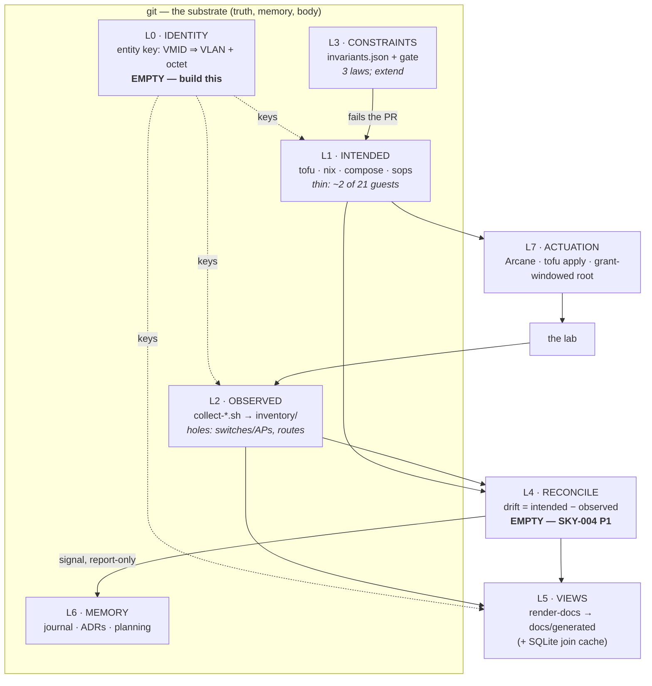

> Agent-generated architecture evaluation. Third of three: the
> [NetBox vs Nautobot note](2026-08-28-netbox-vs-nautobot.md) answered "which product",
> the [source-of-truth note](2026-08-28-source-of-truth-for-this-lab.md) answered "what's
> authoritative for what", and this one answers "what does the *finished* system look like,
> and does Ansible belong in it". Raw, no commitment.

# The complete system — target architecture, alternatives, and where Ansible fits

*Compiled 2026-08-28.*

## 0. What "complete" has to mean here

Generic ops-architecture criteria (throughput, team scale, multi-tenancy) are the wrong yardstick.
This system has exactly one operator model — **an amnesiac LLM agent plus one human learning git** —
and that dictates the scoring:

| Criterion | Why it dominates here |
|---|---|
| **Cold-boot legibility** | Every session is a fresh mind. If state can't be cheaply reconstructed from git, nothing else matters. |
| **Statelessness** | The agent's memory *is* the repo. Anything that lives only in a running service is amnesia waiting to happen. |
| **Reversibility** | `git revert` → converge. Cheap mistakes let a non-deterministic operator act boldly. |
| **Low branching factor** | Each new paradigm is surface the agent can be wrong on. Capability that costs a paradigm is often a bad trade. |
| **No standing credential** | The T1/T2/T3 split is the whole safety story. Any tool that assumes a control node with standing root is disqualified by construction. |
| **Reviewable diffs** | The PR is where a human catches the agent. A change that isn't a readable diff is unreviewed. |
| **Single home per fact** | Duplicated truth drifts. This is the criterion the current system quietly violates (§2, L0). |

A system is **complete when every layer has both a writer and a checker, and every fact has exactly
one home.** By that definition Skynet is ~70% complete, and the missing 30% is two empty layers.

## 1. The target architecture

**L0 · Identity** — the entity key every other layer joins on. ADR 0001's VMID convention already
*is* this key; nothing reads it. Empty.
**L1 · Intended** — tofu (lifecycle), nix (host definition), compose (services), sops (secrets).
Exists, deliberately thin.
**L2 · Observed** — the T1 collectors. Exists; three known holes.
**L3 · Constraints** — authored data, deterministic gate. Exists, small.
**L4 · Reconciliation** — the controller. Empty; this is the loop that never closed.
**L5 · Views** — the renderer. Exists, but is *guessing* because L0 is empty.
**L6 · Memory** — journal, ADRs, directives. Strong.
**L7 · Actuation** — Arcane, `tofu apply`, grant-windowed root. Exists, PR-gated.

The insight worth keeping: **L5's bugs are L0's absence.** The renderer has to guess what a host is
because nothing tells it. Filling L0 fixes L5 and sharpens L4 at the same time — which is why it
outranks everything else on the list.

## 2. Candidate complete systems

Scored as *whole systems*, against §0. **A** is the current architecture with L0 and L4 filled in.

| System | Cold-boot | Stateless | No standing cred | Branching factor | Single home | Verdict |
|---|---|---|---|---|---|---|
| **A · git-native, completed** | ✅ best | ✅ | ✅ | ✅ low | ✅ after L0 | **Adopt** |
| **B · SoT database (NetBox/Nautobot)** | ⚠️ needs the service up | ❌ DB is truth | ⚠️ write token | ⚠️ +2 (app, plugins) | ❌ 4th home | Reject |
| **C · Ansible-centered** | ✅ YAML is legible | ✅ | ❌ control node wants fleet root | ❌ +1 large | ⚠️ authored duplication | Partial (§3) |
| **D · Nix-maximalist** | ✅ maximal | ✅ | ✅ | ❌ steep, and LXC-hostile | ✅ | Partial |
| **E · Infrahub** | ⚠️ | ❌ | ⚠️ | ❌ graph DB + workers | ✅ | Watch only |
| **F · k8s / Crossplane control plane** | ❌ | ❌ | ❌ | ❌❌ | ✅ | Reject outright |

**B — SoT database.** Covered in the companion note. As a *system* the fatal flaw is the "single
home" column: it adds a fourth place identity lives without retiring the other three, in a system
whose actual defect is un-joined truth.

**D — Nix-maximalist.** The most philosophically aligned option: drift becomes structurally
impossible inside the declared surface, and "root grant to harden a host" collapses into "PR a
module". It loses as a *complete* answer for one practical reason — **most of this lab is LXC**
(15 of 21 guests). NixOS-in-LXC is possible and unpleasant; converting the fleet is not a realistic
path. Nix stays right for the hosts it owns, and cannot be the whole answer.

**F — Kubernetes/Crossplane.** Would replace a legible repo with a control plane whose state lives
in etcd and whose failure modes need an expert. Every criterion in §0 says no. Named only so it
stays named-and-rejected.

**A — the recommendation.** Not "do nothing": A is the current shape with its two empty layers
filled, its three collector holes closed, and one idea borrowed from each rejected system —
NetBox's **explicit entity model** (as L0, derived not authored), Ansible's **inventory-as-data**
(as a dynamic view, §3.2), and Infrahub's **diff-as-a-first-class-object** (as L4's output).

## 3. Ansible inventory — what it is, and the three ways it could be used

### 3.0 What it actually is

Ansible's inventory is a **standalone data model that does not require running a playbook**. Three
parts:

1. **The inventory** — hosts and the groups they belong to, as INI or YAML. Groups nest, and a host
   can be in many; group membership is the join.
2. **`group_vars/` and `host_vars/`** — directories of YAML keyed by group or host name. Variables
   merge down the group hierarchy with defined precedence, so `all` → `proxmox` → `dmz` → the host
   layers facts onto an entity. This is the part people actually mean when they praise it.
3. **Inventory plugins** — code that *generates* the inventory from a live source instead of a
   file: `community.general.proxmox`, `community.general.online`, a NetBox plugin, and so on.
   Hosts arrive with facts attached and auto-grouped by tag, pool, status, node.

The tooling is usable on its own: `ansible-inventory --list` emits the whole resolved model as
**JSON**, `--graph` prints the group tree. Any consumer — a renderer, a gate, `jq` — can eat that
without Ansible ever connecting to a host. Worth knowing that the format is genuinely just data.

### 3.1 As an authored entity spine (L0) — **no**

The obvious use: hand-write `inventory.yml` + `group_vars/`, get the entity registry L0 wants, with
inheritance for free.

It loses to the VMID derivation on the criterion that matters most: **single home per fact**. Almost
everything such a file would hold — a guest's node, VMID, name, status, pool, and (by ADR 0001) its
address — is *already* collected from Proxmox or *derivable* from the key. Authoring it by hand
creates a third copy of facts that already exist twice, and hand-maintained inventories are the
canonical thing that drifts. It also runs against ADR 0003: authored data is justified when a
deterministic consumer needs it, and here the consumer can compute the same facts instead.

Secondary strikes: YAML's implicit typing (the Norway problem — `no` becomes `false`) in a file
describing network gear, and Ansible's variable-precedence rules are famously subtle — a poor
property for a document whose entire job is to be unambiguous.

**Where an authored file *is* justified:** the facts that are genuinely judgment, not observation —
which entity is a proxy front door, what VLAN 70 is *called*, which guests are intentional
convention exceptions. That's a short list, it belongs next to `invariants.json`, and it does not
need Ansible's format to hold it.

### 3.2 As a dynamic view over observed truth — **yes, cheaply, later**

Flip it around: use the **Proxmox inventory plugin** so the inventory is *generated* from the same
API the collectors already read. Now it's not a new source of truth — it's another rendering of L2,
the same category as `docs/generated/`. Cost is one YAML config; it stays correct by construction;
it composes with the VMID spine rather than competing.

That's worth having the day something wants to consume it — which is §3.3.

### 3.3 As a playbook runtime — **a real niche, and a real collision**

This is where Ansible genuinely competes, and the honest case for it is stronger than I gave it
credit for. Two things in the repo are textbook Ansible:

- **`runbooks/update-guests.md`** — snapshot, `apt full-upgrade`, conditional reboot, health verify,
  roll back on failure, across the fleet. Today: an agent looping under a fleet root grant. That is
  precisely what a playbook with `serial:` and a rescue block does, deterministically.
- **`scripts/onboard-host.sh`** — install CA trust, principal mapping, create `svc-ops`, docker
  group. A role would express this idempotently instead of as a bash script run once by hand.

And the niche is real: **nix will never own the ~15 Debian/Ubuntu LXC guests.** For those hosts the
choice isn't "nix or Ansible", it's "Ansible or keep doing it imperatively under a grant".

The collision is equally real, and it's structural, not aesthetic: **Ansible's model assumes a
control node with standing SSH and `become: root` to the whole fleet** — the exact thing §6 forbids
and the CA-certificate design was built to prevent. It is not fatal (Ansible can be pointed at a
certificate and a principal, so it runs *inside* a grant window and expires with it), but it must be
a deliberate constraint, decided up front, or the tool's defaults will quietly re-create standing
root.

**Verdict:** defensible as a **later, narrow** addition — grant-windowed, LXC-only, replacing two
named imperative procedures, never a standing control node. It is not the spine, not the source of
truth, and not urgent. If it lands, §3.2 supplies its inventory and L0 supplies its host keys.

## 4. Verdict and sequencing

**The best complete system is A: the current architecture, finished.** In order:

1. **Fill L0** — VMID identity spine: join key in the renderer, derivation as an invariant,
   judgment-facts (VLAN names, proxy set, convention exceptions) into authored data beside
   `invariants.json`. *Everything else gets easier after this.*
2. **Fill L4** — drift diff, report-only, entity-attributed (SKY-004 P1).
3. **Close L2's holes** — UniFi/Omada collector, Caddy route collector.
4. **Widen L1 deliberately** — Technitium records, then the ops-managed pool, one PR at a time.
5. *Then, optionally:* the SQLite join cache (L5), and Ansible under §3.3's constraints for the LXC
   fleet. Both are refinements of a finished system, not parts of it.

Steps 1–4 add no service, no standing credential, and no backup obligation. That is the test any
addition to this system should have to pass.
